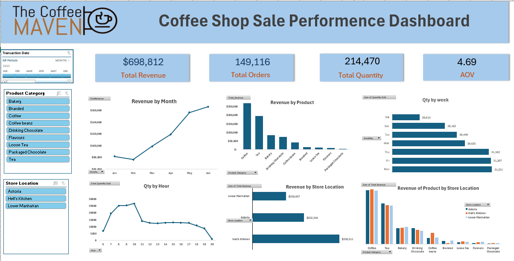

# ☕ Maven Coffee Shop Analysis (Excel Project)
Interactive Excel dashboard for analyzing coffee shop sales performance, customer behavior, and operational patterns.

# 📌 Overview
This project focuses on analyzing coffee shop sales data using Microsoft Excel. The goal is to transform raw transactional data into a clear and interactive dashboard that highlights key business metrics.

**The analysis compares performance across:**
- Product categories
- Store locations
- Days of the week
- Hours of operation

The dashboard supports better decision-making in sales strategy, marketing, inventory planning, and staffing.

# 📂 Data Source
- **Source:** Kaggle – Coffee Shop Dataset
- **Structure:** Single table dataset
  
**Key Fields:**
- Transaction ID
- Transaction Date & Time
- Quantity Sold
- Unit Price
- Revenue
- Store Location
- Product Category
  
# 🧹 Data Cleaning & Preparation

**The dataset was prepared using Excel to ensure accuracy and usability:

- Converted transaction date/time into proper Excel format
- Standardized time display to AM/PM format
- Created new columns for analysis:
    - **Hour** → using HOUR()
    - **Day of Week** → using TEXT(date, "ddd")
    -**Month** → using TEXT(date, "mmm")
- Calculated Total Revenue = Quantity × Unit Price
- Validated all numeric fields for accuracy

# 🛠️ Tools Used
- **Microsoft Excel:**
  Pivot Tables
Pivot Charts
Slicers
Excel Functions (HOUR, TEXT, calculations)

📊 Analysis Approach
- Performed data cleaning and transformation to prepare the dataset
- Created calculated fields such as Hour, Day, Month, and Total Revenue
- Used Pivot Tables to aggregate and summarize sales data
- Built an interactive dashboard to explore:
    - Sales performance by time (hour, day, month)
    - Performance across store locations
    - Product category trends
      
# 📈 Key Insights
- Sales performance varies significantly by time of day, with peak hours driving the majority of revenue
- Certain product categories outperform others, contributing more to total sales
- Store locations show different performance patterns, indicating potential for location-based strategies
Weekly trends highlight high-traffic days that require optimized staffing

# 🚀 Recommendations
- Optimize staffing schedules during peak hours to improve service efficiency
- Focus on high-performing products while promoting underperforming items
- Adjust marketing strategies based on location-specific performance
- Improve inventory planning using demand patterns by day and time

# 📸 Dashboard Preview

